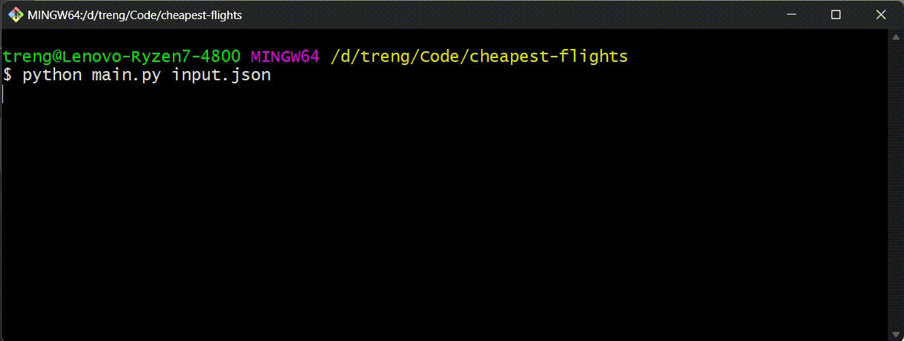

# Cheapest Flights Finder

A Python program that finds the cheapest flight route between cities with a maximum number of stops allowed.

## Features

- Finds cheapest route using modified _**Bellman-Ford**_ algorithm
- Handles multiple cities and flight routes
- Allows specifying maximum number of stops
- Reads input from JSON file
- Includes comprehensive test suite

## Usage

1. Prepare your input JSON file `(input.json)`:
```json
{
    "n": 4,              // number of cities
    "flights": [         // flight routes
        [0, 1, 100],     // [from_city, to_city, price]
        [1, 2, 100],
        [2, 3, 200]
    ],
    "src": 0,           // source city
    "dst": 3,           // destination city
    "k": 1              // max stops allowed
}
```

2. Run the program:
```bash
python main.py input.json
```

## Example

Input:
- Cities: 0, 1, 2, 3
- Flights: 
  - 0 → 1 ($100)
  - 1 → 2 ($100)
  - 2 → 0 ($100)
  - 1 → 3 ($600)
  - 2 → 3 ($200)
- From: City 0
- To: City 3
- Max stops: 1

Output:
```
The cheapest price from city 0 to city 3 with at most 1 stops is: 700
```

## Working Code Visualization



## Project Structure

```
cheapest-flights/
│
├── main.py                   # Main program implementation
├── test_main.py              # Test suite
├── input.json                # Sample input data
├── Readme.md                 # Documentation
└── images
    └── cheapest-flights.gif  # Working code visualization
```

## Algorithm Explanation

The program uses a modified Bellman-Ford algorithm to find the cheapest route:

1. Initialize distances:
   ```
   [0, ∞, ∞, ∞]  # Source city = 0
   ```

2. For each allowed stop (k+1 iterations):
   ```
   Step 1: [0, 100, ∞, ∞]     # Found route to city 1
   Step 2: [0, 100, 200, 700] # Found routes to cities 2 and 3
   ```

3. Final result: 700 (Route: 0 → 1 → 3)

## Error Handling

Common error messages:
- `"File not found"` : Check if input.json exists
- `"Invalid JSON format"` : Verify JSON syntax
- `"-1 result"` : No valid route found with given stops


## Testing

Run the test suite:
```bash
python -m unittest test_main.py
```

## Requirements

- Python 3.10+
- No external dependencies required

## Implementation Details

- Uses adjacency list for graph representation
- Implements modified Bellman-Ford algorithm
- Time complexity: O(k * E) where:
  - k = number of stops allowed
  - E = number of flights
